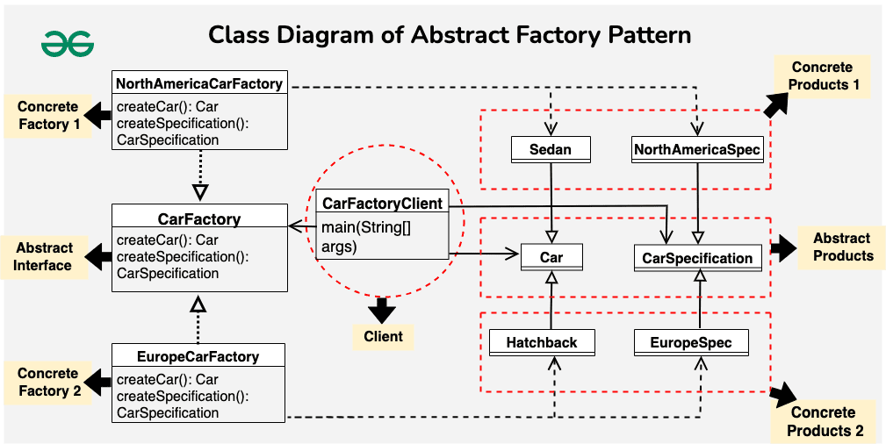

# Abstract Factory Design Pattern 
- Definition: Abstract Factory Pattern defines an interface for creating families of related objects without specifying their concrete types.
- Higher Level: It's one level higher than the Factory Pattern, providing a way to create families of related objects.
- Advantages:
    - Isolates client code from concrete implementations. 
    - Eases swapping object families. 
    - Promotes consistency among objects.
- Usage:
  - When the system should be independent of how objects are created. 
  - When related objects must be used together. 
  - When providing a library revealing only interfaces. 
  - When the system needs to be configured with one of multiple object families.

> Imagine you’re managing a global car manufacturing company. You want to design a system to create cars with specific configurations for different regions, such as North America and Europe. Each region may have unique requirements and regulations, and you want to ensure that cars produced for each region meet those standards.

- What can be the challenges while implementing this system?
  - One challenge can be designing cars with specific features and configurations for different regions.
  - The other main challenge is to ensure consistency in the production of cars and their specifications within each region.
  - Adapting the system to changes in regulations or introducing new features for a specific region becomes challenging. Modifications would need to be made in multiple places, increasing the chances of introducing bugs and making the system more prone to errors.
- How Abstract Factory Pattern help to solve above challenges?
  - The abstract factory ensures that each region has its concrete factory, responsible for creating cars and specifications consistent with the local market requirements. This promotes consistency in the design and features of the vehicles produced for each region.
  - Each concrete factory encapsulates the logic for creating cars and specifications specific to a region. This isolation allows you to make changes or introduce new features for a particular region without affecting the rest of the system. For example, if regulations change in North America, you can modify the NorthAmericaCarFactory without impacting the EuropeCarFactor.
  - Adding support for a new region involves creating a new concrete factory for that region. This expansion can be done without modifying existing code, providing a scalable and modular solution.
  - The pattern promotes a clear separation between the creation of products (cars and specifications) and their actual use.

<b>AbstractFactoryExample</b>