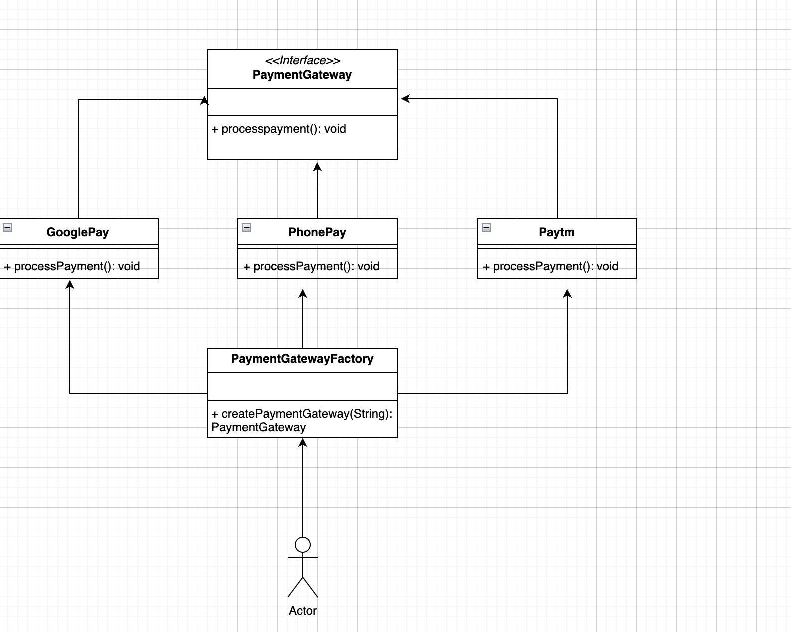

# Factory Design Pattern

- Encapsulates object creation logic within the factory class.
- Separates client code from the details of object instantiation.
- Offers a common interface for clients to interact with the factory.
- Allows clients to obtain newly created objects without needing to know creation specifics.
- Facilitates flexibility in object creation and maintains consistency in interface usage across implementations.

<b>FactoryExample</b> 